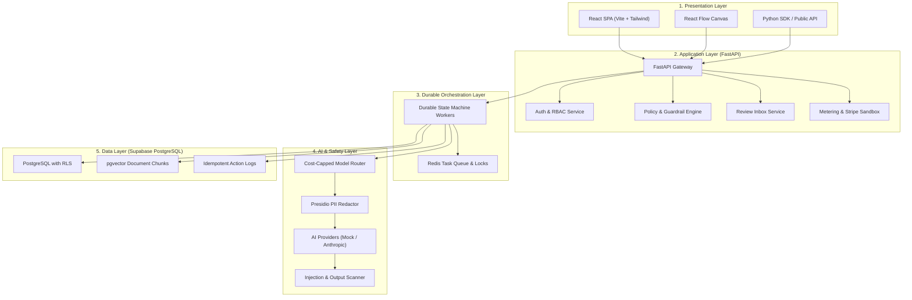

# System Architecture

> [!NOTE] This document provides an overview of the overall system components and their interactions.

```mermaid
flowchart TD
    subgraph Presentation_Layer ["1. Presentation Layer"]
        UI["React SPA (Vite + Tailwind)"]
        Canvas["React Flow Canvas"]
        SDK["Python SDK / Public API"]
    end
    subgraph Application_Layer ["2. Application Layer (FastAPI)"]
        API["FastAPI Gateway"]
        AuthSvc["Auth & RBAC Service"]
        PolicySvc["Policy & Guardrail Engine"]
        ReviewSvc["Review Inbox Service"]
        BillSvc["Metering & Stripe Sandbox"]
    end
    subgraph Orchestration_Layer ["3. Durable Orchestration Layer"]
        Worker["Durable State Machine Workers"]
        Queue["Redis Task Queue & Locks"]
    end
    subgraph AI_Layer ["4. AI & Safety Layer"]
        Router["Cost‑Capped Model Router"]
        Presidio["Presidio PII Redactor"]
        Guard["Injection & Output Scanner"]
        LLM["AI Providers (Mock / Anthropic)"]
    end
    subgraph Data_Layer ["5. Data Layer (Supabase PostgreSQL)"]
        Postgres["PostgreSQL with RLS"]
        Vector["pgvector Document Chunks"]
        Outbox["Idempotent Action Logs"]
    end
    UI --> API
    Canvas --> API
    SDK --> API
    API --> AuthSvc
    API --> PolicySvc
    API --> ReviewSvc
    API --> BillSvc
    API --> Worker
    Worker --> Queue
    Worker --> Router
    Router --> Presidio --> LLM --> Guard
    Worker --> Postgres
    Worker --> Vector
    Worker --> Outbox
```